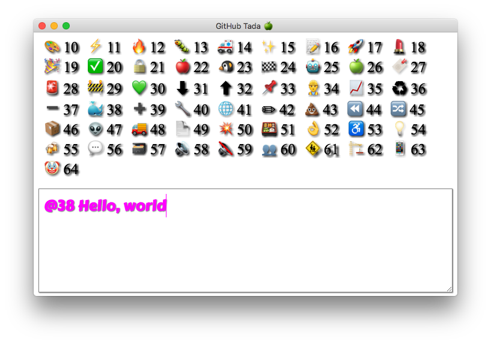

## GitHub Tada

Emoji Editor



## Installation

- Double click `GitHub Tada.dmg`, move `GitHub Tada` to Applications
- Create Automator service, add `Launch Application`, select `GitHub Tada`
- Define keyboard shortcut for invoke `GitHub Tada`, open `System Preferences > Keyboard > Shortcuts` set `Control + Command + C`

## Usage

- Press `Control + Command +  C` to launch application
- Type `@38 Hello, world!"`, Press `Alt + Enter` to exit
- Press `Command + V` to paste text

## Result

🐳 Hello, world!

## Development

```bash
npm install
webpack --watch
eletron .
```

## Create installer

```bash
bash release-mac.sh
```